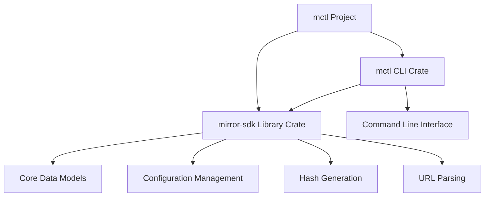
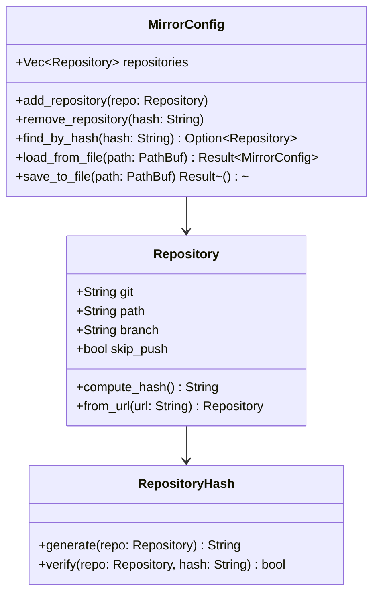
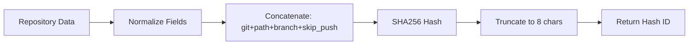
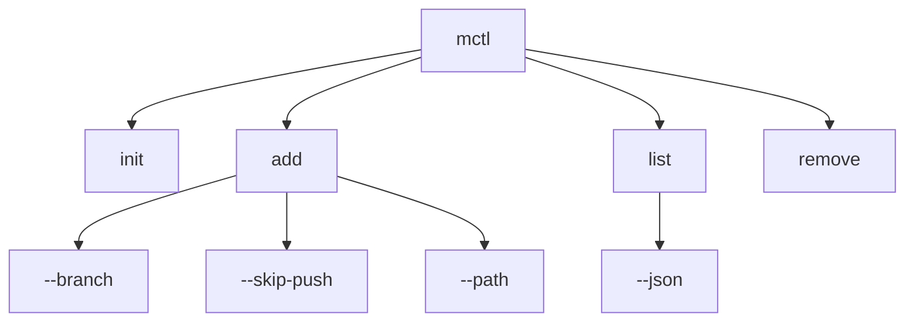
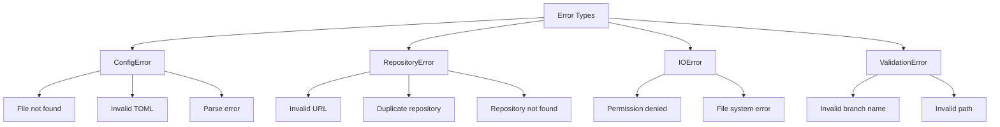

# Technical Specification: mctl - Mirror Configuration Management Tool

## Project Overview

The `mctl` project consists of two Rust crates designed for managing `mirror.toml` configuration files that define collections of git repositories for large-scale IT projects, including read-only mirrors of external repositories.

## Project Structure



## Architecture Design

### 1. Workspace Structure
```
mctl/
├── Cargo.toml                 # Workspace manifest
├── README.md
├── LICENSE
├── DESIGN.md                  # This file
├── mctl/                      # CLI binary crate
│   ├── Cargo.toml
│   ├── src/
│   │   ├── main.rs
│   │   ├── commands/
│   │   │   ├── mod.rs
│   │   │   ├── init.rs
│   │   │   ├── add.rs
│   │   │   ├── list.rs
│   │   │   └── remove.rs
│   │   ├── cli.rs
│   │   └── error.rs
│   └── tests/
└── mirror-sdk/                # Library crate
    ├── Cargo.toml
    ├── src/
    │   ├── lib.rs
    │   ├── models.rs
    │   ├── config.rs
    │   ├── hash.rs
    │   ├── url_parser.rs
    │   └── error.rs
    └── tests/
```

### 2. Data Models



## Requirements Analysis

### mirror.toml Structure
```toml
[[repositories]]
git = "git@github.com:mirrorboards/graphene-ws.git"
path = "mirrorboards/graphene-ws" 
branch = "main"  # optional, defaults to "main"
skip-push = false  # optional, defaults to false
```

### CLI Commands Required
- `mctl init` - create empty mirror.toml
- `mctl add <git_url> [--branch <branch>] [--skip-push] [--path <path>]` - add repository
- `mctl list [--json]` - list repositories with unique hash IDs
- `mctl remove <hash>` - remove repository by hash

### SDK Requirements
- Read/parse mirror.toml files
- Write/update mirror.toml files
- Generate unique hash IDs for repositories (based on all metadata)
- Handle defaults (branch="main", skip-push=false, path="${org}/${repo}")
- Support both SSH and HTTPS URL formats for path extraction

## Core Components Design

### 1. Mirror SDK Library (`mirror-sdk`)

#### Data Models (`models.rs`)
```rust
use serde::{Deserialize, Serialize};

#[derive(Debug, Clone, Serialize, Deserialize, PartialEq, Eq)]
pub struct Repository {
    pub git: String,
    pub path: String,
    #[serde(default = "default_branch")]
    pub branch: String,
    #[serde(default = "default_skip_push", rename = "skip-push")]
    pub skip_push: bool,
}

#[derive(Debug, Serialize, Deserialize)]
pub struct MirrorConfig {
    pub repositories: Vec<Repository>,
}

fn default_branch() -> String {
    "main".to_string()
}

fn default_skip_push() -> bool {
    false
}

impl Repository {
    pub fn from_url(git_url: String) -> Result<Self, RepositoryError> {
        let path = extract_path_from_url(&git_url)?;
        Ok(Repository {
            git: git_url,
            path,
            branch: default_branch(),
            skip_push: default_skip_push(),
        })
    }
    
    pub fn compute_hash(&self) -> String {
        generate_hash(self)
    }
}
```

#### Configuration Management (`config.rs`)
**Core Responsibilities:**
- Load/parse TOML files with proper error handling
- Validate repository entries for consistency
- Handle file I/O operations safely
- Merge configurations from multiple sources
- Provide backup/restore functionality
- Manage concurrent access to configuration files

**Key Functions:**
```rust
impl MirrorConfig {
    pub fn load_from_file<P: AsRef<Path>>(path: P) -> Result<Self, ConfigError>
    pub fn save_to_file<P: AsRef<Path>>(&self, path: P) -> Result<(), ConfigError>
    pub fn add_repository(&mut self, repo: Repository) -> Result<(), ConfigError>
    pub fn remove_repository(&mut self, hash: &str) -> Result<Repository, ConfigError>
    pub fn find_by_hash(&self, hash: &str) -> Option<&Repository>
    pub fn validate(&self) -> Result<(), ValidationError>
}
```

#### Hash Generation (`hash.rs`)


**Implementation Strategy:**
- Use SHA256 for cryptographic strength
- Normalize all fields (trim whitespace, lowercase where appropriate)
- Concatenate in deterministic order: `git|path|branch|skip_push`
- Truncate to 8 characters for user-friendly IDs
- Handle hash collisions by extending length if needed

#### URL Parser (`url_parser.rs`)
```mermaid
flowchart TD
    A[Git URL Input] --> B{URL Format?}
    B -->|SSH| C[git@host:org/repo.git]
    B -->|HTTPS| D[https://host/org/repo.git]
    B -->|Other| E[Error: Unsupported Format]
    C --> F[Extract org/repo]
    D --> F
    F --> G[Generate default path]
```

**Supported Formats:**
- SSH: `git@github.com:org/repo.git` → `org/repo`
- HTTPS: `https://github.com/org/repo.git` → `org/repo`
- HTTPS with path: `https://git.example.com/group/subgroup/repo` → `group/subgroup/repo`

### 2. CLI Tool (`mctl`)

#### Command Structure


#### Command Implementations

**Init Command (`commands/init.rs`)**
- Create empty `mirror.toml` in current directory
- Handle existing file scenarios (prompt for overwrite)
- Set up basic TOML structure with comments
- Validate write permissions

**Add Command (`commands/add.rs`)**
- Parse git URL with comprehensive format support
- Extract default path from URL using regex patterns
- Apply command-line overrides for path, branch, skip-push
- Validate repository doesn't already exist (by hash)
- Update configuration file atomically

**List Command (`commands/list.rs`)**
- Display repositories in human-readable table format
- Show hash IDs, git URLs, paths, branches, and skip-push status
- Support JSON output format for scripting
- Handle empty configuration gracefully
- Add filtering options for future extensibility

**Remove Command (`commands/remove.rs`)**
- Find repository by hash ID with partial matching support
- Display repository details before removal
- Confirm removal with interactive prompt
- Support `--force` flag to skip confirmation
- Update configuration file atomically

## Dependencies Planning

### SDK Dependencies (`mirror-sdk/Cargo.toml`)
```toml
[dependencies]
serde = { version = "1.0", features = ["derive"] }
toml = "0.8"
sha2 = "0.10"           # For hash generation
regex = "1.0"           # For URL parsing
url = "2.0"             # For URL validation
thiserror = "1.0"       # For error handling
uuid = { version = "1.0", features = ["v4"] }  # Fallback for hash collisions

[dev-dependencies]
tempfile = "3.0"        # For testing file operations
```

### CLI Dependencies (`mctl/Cargo.toml`)
```toml
[dependencies]
mirror-sdk = { path = "../mirror-sdk" }
clap = { version = "4.0", features = ["derive"] }
serde_json = "1.0"      # For JSON output
anyhow = "1.0"          # For CLI error handling
colored = "2.0"         # For colored output
dialoguer = "0.11"      # For interactive prompts
tabled = "0.15"         # For table formatting

[dev-dependencies]
assert_cmd = "2.0"      # For CLI testing
predicates = "3.0"      # For assertion helpers
tempfile = "3.0"        # For temporary test files
```

## Error Handling Strategy



**Error Handling Principles:**
- Use `thiserror` for structured error types in SDK
- Use `anyhow` for simplified error handling in CLI
- Provide helpful error messages with context
- Implement proper error recovery where possible
- Log errors appropriately for debugging

## Implementation Plan

### Phase 1: Core SDK Development (Week 1-2)

#### 1.1 Data Models & Serialization
- [ ] Define `Repository` and `MirrorConfig` structs
- [ ] Implement serde traits for TOML serialization/deserialization
- [ ] Add validation logic and custom deserializers
- [ ] Create comprehensive unit tests for data models

#### 1.2 Configuration Management
- [ ] Implement file I/O operations with proper error handling
- [ ] Add TOML parsing and writing functionality
- [ ] Create atomic file update mechanisms
- [ ] Add configuration validation and consistency checks

#### 1.3 Hash Generation System
- [ ] Implement deterministic hashing algorithm
- [ ] Add hash collision detection and resolution
- [ ] Create hash verification functions
- [ ] Add performance benchmarks for large configurations

#### 1.4 URL Parser
- [ ] Support SSH format parsing (`git@host:org/repo.git`)
- [ ] Support HTTPS format parsing (`https://host/org/repo.git`)
- [ ] Handle edge cases and malformed URLs
- [ ] Add comprehensive URL parsing tests

### Phase 2: CLI Development (Week 3-4)

#### 2.1 Command Line Interface Setup
- [ ] Set up clap argument parsing with derive macros
- [ ] Define command structures and subcommands
- [ ] Implement comprehensive help system
- [ ] Add shell completion support

#### 2.2 Command Implementations
- [ ] `init` command with file creation and validation
- [ ] `add` command with URL parsing and option handling
- [ ] `list` command with table formatting and JSON output
- [ ] `remove` command with interactive confirmation

#### 2.3 User Experience Enhancements
- [ ] Add colored output for better readability
- [ ] Implement progress indicators for long operations
- [ ] Add interactive confirmation prompts
- [ ] Create comprehensive CLI help and examples

### Phase 3: Testing & Documentation (Week 5)

#### 3.1 Comprehensive Testing
- [ ] Unit tests for all SDK functionality
- [ ] Integration tests for CLI commands
- [ ] Error handling and edge case tests
- [ ] Performance tests for large configurations

#### 3.2 Documentation
- [ ] API documentation with rustdoc
- [ ] CLI help system and man pages
- [ ] Usage guides and examples
- [ ] Architecture documentation updates

### Phase 4: Advanced Features (Week 6+)

#### 4.1 Configuration Validation
- [ ] Repository accessibility checks (optional)
- [ ] Branch existence validation
- [ ] Path conflict detection
- [ ] Comprehensive validation reporting

#### 4.2 Performance Optimization
- [ ] Lazy loading for large configurations
- [ ] Efficient hash lookups with HashMap indexing
- [ ] Memory usage optimization
- [ ] Parallel operations for bulk commands

#### 4.3 Extensibility Features
- [ ] Plugin system architecture design
- [ ] Custom hash algorithms support
- [ ] Additional output formats (YAML, XML)
- [ ] Configuration file format versioning

## Configuration Examples

### Basic mirror.toml
```toml
[[repositories]]
git = "git@github.com:mirrorboards/graphene-ws.git"
path = "mirrorboards/graphene-ws"
branch = "main"
skip-push = false

[[repositories]]
git = "https://github.com/external/readonly-lib.git"
path = "external/readonly-lib"
branch = "v2.1"
skip-push = true

[[repositories]]
git = "git@gitlab.internal:team/private-tool.git"
path = "internal/private-tool"
# branch defaults to "main"
# skip-push defaults to false
```

### CLI Usage Examples

```bash
# Initialize new configuration
mctl init

# Add repository with automatic path detection
mctl add git@github.com:org/repo.git
# Results in: path = "org/repo", branch = "main", skip-push = false

# Add repository with custom options
mctl add https://github.com/external/lib.git --branch v2.0 --skip-push --path custom/path

# List all repositories
mctl list
# Output:
# Hash     | Git URL                              | Path            | Branch | Skip Push
# ---------|--------------------------------------|-----------------|--------|----------
# a1b2c3d4 | git@github.com:org/repo.git         | org/repo        | main   | false
# e5f6g7h8 | https://github.com/external/lib.git  | custom/path     | v2.0   | true

# List repositories in JSON format
mctl list --json
# Output: [{"git": "...", "path": "...", "branch": "...", "skip_push": false, "hash": "..."}]

# Remove repository by hash
mctl remove a1b2c3d4
# Prompts: "Remove repository git@github.com:org/repo.git? [y/N]"

# Force remove without confirmation
mctl remove e5f6g7h8 --force
```

## Future Considerations

### Potential Enhancements
1. **Configuration Templates**: Predefined templates for common repository patterns
2. **Bulk Operations**: Import/export functionality for large-scale migrations
3. **Integration Hooks**: Git hooks integration for automatic configuration updates
4. **Web Interface**: Optional web UI for managing configurations
5. **Multi-file Support**: Support for including multiple configuration files
6. **Environment Variables**: Support for environment variable substitution in URLs/paths

### Scalability Considerations
- **Large Configurations**: Optimize for configurations with 1000+ repositories
- **Concurrent Access**: Handle multiple processes accessing the same configuration
- **Network Operations**: Add retry logic and timeout handling for remote operations
- **Caching**: Implement intelligent caching for frequently accessed data

### Security Considerations
- **Credential Handling**: Secure handling of git credentials and SSH keys
- **File Permissions**: Proper file permission management for configuration files
- **Input Validation**: Comprehensive validation to prevent injection attacks
- **Audit Logging**: Optional audit trail for configuration changes

This design provides a robust foundation for the mctl project while maintaining flexibility for future enhancements and scaling requirements.