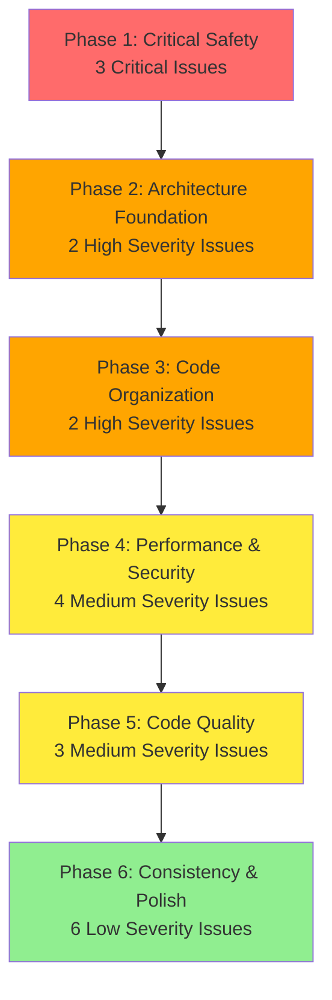
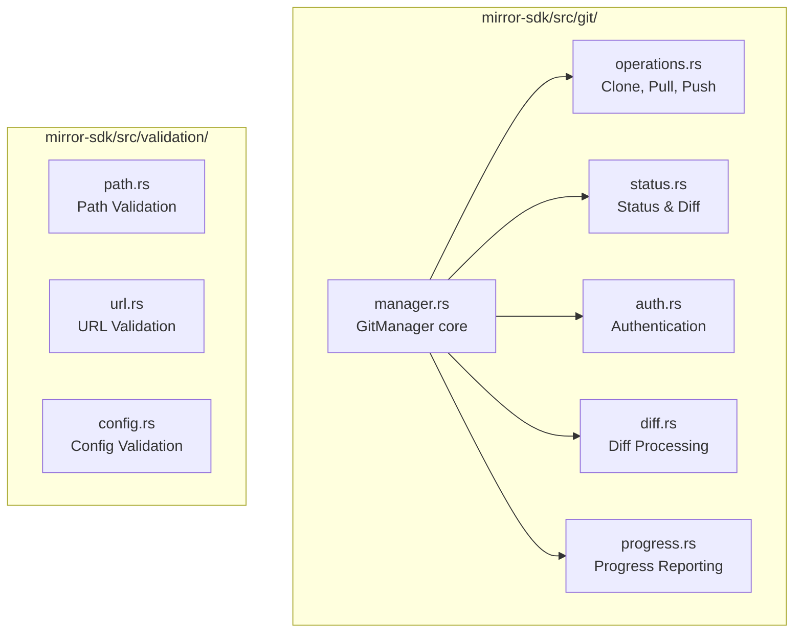
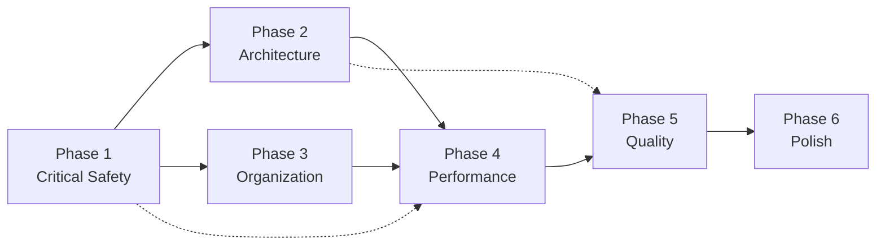
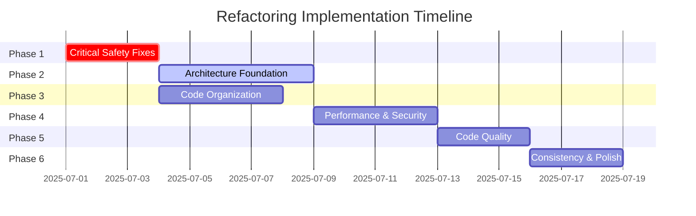

# Comprehensive Rust Codebase Refactoring Plan
## mctl CLI Tool + mirror-sdk Quality Transformation

**Document Version**: 1.0  
**Created**: 2025-06-27  
**Target**: Military-grade code quality  
**Total Issues**: 17 (3 Critical, 4 High, 7 Medium, 6 Low)

---

## Executive Summary

This document outlines a systematic approach to transform the mctl CLI tool and mirror-sdk codebase from its current state to military-grade quality. The refactoring addresses 17 identified quality issues across all severity levels through 6 carefully orchestrated phases designed to maintain functionality while eliminating technical debt.

### Key Objectives
- **Eliminate all critical safety issues** immediately
- **Restructure monolithic components** for maintainability
- **Optimize performance** and resource usage
- **Standardize code patterns** across the entire codebase
- **Achieve 90%+ test coverage** with comprehensive quality gates

---

## Quality Issues Overview

### Critical Issues (3) 🔴
1. **Anti-pattern error handling** by string matching in `save.rs:116`
2. **Semantic error type misuse** in `models.rs:115-117`
3. **Unsafe file system operations** in `save.rs:100-105`

### High Severity (4) 🟠
4. **Monolithic git.rs file** (1,088 lines)
5. **Logic duplication** across commands
6. **Path normalization duplication**
7. **Insufficient path validation**

### Medium Severity (7) 🟡
8. **Inefficient hash collision detection**
9. **Potential credential exposure**
10. **Complex conditional logic** in sync.rs
11. **Hardcoded magic values**
12. **Mixed concerns in validation**
13. **Redundant string operations**
14. **Regex compilation caching**

### Low Severity (6) 🟢
15. **Timestamp calculation panic risk**
16. **Inconsistent error chain handling**
17. **Output method inconsistency** (179 instances)

---

## Phase Implementation Plan



---

## Phase 1: Critical Safety Fixes 🔴

**Priority**: CRITICAL | **Complexity**: Medium | **Effort**: 2-3 days

### Issues Addressed
- **Issue #1**: Anti-pattern error handling by string matching (`save.rs:116`)
- **Issue #2**: Semantic error type misuse (`models.rs:115-117`)
- **Issue #3**: Unsafe file system operations (`save.rs:100-105`)

### Current Problems
```rust
// ANTI-PATTERN: String-based error matching
if e.to_string().contains("No changes to commit") {
    // Handle "no changes" case
}

// SEMANTIC ERROR: Using wrong error type
return Err(RepositoryError::InvalidUrl {
    url: format!("Repository with hash '{}' already exists", new_hash)
}.into());

// UNSAFE: No path validation or sandboxing
if !target_path.join(".git").exists() {
    // Potential path traversal vulnerability
}
```

### Implementation Strategy

#### 1. Create Structured Error Types
```rust
#[derive(Error, Debug)]
pub enum GitOperationError {
    #[error("No changes to commit in repository")]
    NoChangesToCommit,
    #[error("Repository has uncommitted changes")]
    UncommittedChanges,
    #[error("Branch {branch} does not exist")]
    BranchNotFound { branch: String },
    // ... other semantic errors
}
```

#### 2. Implement Secure Path Operations
```rust
pub struct SecurePathValidator {
    allowed_base_paths: Vec<PathBuf>,
    max_depth: usize,
}

impl SecurePathValidator {
    pub fn validate_and_resolve(&self, path: &Path) -> Result<PathBuf, SecurityError> {
        // Comprehensive path validation with sandboxing
    }
}
```

#### 3. Fix Error Type Semantics
- Replace `InvalidUrl` with appropriate error types
- Create `DuplicateRepository` error variant
- Implement proper error chain propagation

### Acceptance Criteria
- [ ] Zero string-based error matching in codebase
- [ ] All error types semantically correct and documented
- [ ] File system operations validated and sandboxed
- [ ] Path traversal attacks prevented
- [ ] All existing functionality preserved
- [ ] Comprehensive test suite for security edge cases

### Testing Requirements
- Path traversal attack tests
- Error handling edge cases
- Security boundary validation
- Backward compatibility verification

---

## Phase 2: Architecture Foundation 🟠

**Priority**: HIGH | **Complexity**: Complex | **Effort**: 4-5 days

### Issues Addressed
- **Issue #4**: Monolithic `git.rs` file (1,088 lines)
- **Issue #12**: Mixed concerns in validation

### Current Problem
The `git.rs` file contains multiple responsibilities:
- Git repository management (GitManager)
- Clone/pull/push operations  
- Status checking and diff generation
- SSH authentication handling
- Progress reporting
- Error handling and recovery

### Target Architecture



### Implementation Strategy

#### 1. Git Module Decomposition
```rust
// git/manager.rs - Core GitManager (~200 lines)
pub struct GitManager {
    ssh_manager: SshManager,
    operations: GitOperations,
    status_checker: GitStatusChecker,
}

// git/operations.rs - Repository operations (~250 lines)
pub struct GitOperations {
    auth_handler: AuthHandler,
    progress_reporter: ProgressReporter,
}

// git/status.rs - Status and diff operations (~200 lines)
pub struct GitStatusChecker {
    diff_formatter: DiffFormatter,
}

// git/auth.rs - Authentication handling (~200 lines)
pub struct AuthHandler {
    ssh_manager: SshManager,
    credential_cache: CredentialCache,
}
```

#### 2. Validation Module Reorganization
```rust
// validation/mod.rs - Central validation coordinator
pub struct ValidationCoordinator {
    path_validator: PathValidator,
    url_validator: UrlValidator,
    config_validator: ConfigValidator,
}

// validation/path.rs - Comprehensive path validation
pub struct PathValidator {
    security_policy: SecurityPolicy,
    normalization_rules: NormalizationRules,
}
```

#### 3. Dependency Injection Framework
```rust
pub trait GitOperationProvider {
    fn clone_repository(&self, config: &RepoConfig, target: &Path) -> GitResult<()>;
    fn update_repository(&self, path: &Path) -> GitResult<()>;
}

pub struct GitManagerBuilder {
    ssh_manager: Option<SshManager>,
    progress_reporter: Option<Box<dyn ProgressReporter>>,
    auth_handler: Option<AuthHandler>,
}
```

### Acceptance Criteria
- [ ] `git.rs` split into 6 focused modules (<300 lines each)
- [ ] Clear module boundaries with minimal coupling
- [ ] Dependency injection system implemented
- [ ] Validation logic centralized and testable
- [ ] No functionality regression
- [ ] Comprehensive module documentation
- [ ] Integration tests pass
- [ ] Performance benchmarks maintained

### Migration Strategy
1. Create new module structure alongside existing code
2. Implement new interfaces with feature flags
3. Migrate functionality module by module
4. Remove old implementation after validation
5. Update all dependent code

---

## Phase 3: Code Organization 🟠

**Priority**: HIGH | **Complexity**: Medium | **Effort**: 3-4 days

### Issues Addressed
- **Issue #5**: Logic duplication across commands
- **Issue #6**: Path normalization duplication
- **Issue #7**: Insufficient path validation

### Current Duplication Analysis
```rust
// Duplicated across multiple files:
// - Path normalization (3 different implementations)
// - Repository loading patterns
// - Progress bar setup
// - Error handling patterns
// - Verbose output logic
```

### Implementation Strategy

#### 1. Shared Command Utilities
```rust
// mctl/src/shared/mod.rs
pub mod command_base;
pub mod progress;
pub mod output;
pub mod validation;

// command_base.rs - Common command patterns
pub trait CommandBase {
    fn load_config(&self, config_manager: &ConfigManager) -> Result<MirrorConfig>;
    fn setup_progress(&self, total: usize) -> Option<ProgressManager>;
    fn filter_active_repos(&self, repos: &[Repository]) -> Vec<&Repository>;
}

pub struct CommandExecutionContext {
    pub config_manager: ConfigManager,
    pub verbose: bool,
    pub progress_manager: Option<ProgressManager>,
}
```

#### 2. Unified Path System
```rust
// mirror-sdk/src/path/mod.rs
pub struct PathManager {
    validator: PathValidator,
    normalizer: PathNormalizer,
    security_policy: SecurityPolicy,
}

impl PathManager {
    pub fn normalize_and_validate(&self, path: &str) -> PathResult<PathBuf> {
        let normalized = self.normalizer.normalize(path)?;
        self.validator.validate(&normalized)?;
        Ok(normalized)
    }
    
    pub fn check_conflicts(&self, paths: &[String]) -> Vec<PathConflict> {
        // O(n log n) conflict detection using sorted paths
    }
}
```

#### 3. Command Workflow Abstraction
```rust
// Standardized command execution pattern
pub struct CommandExecutor<T: Command> {
    command: T,
    context: CommandExecutionContext,
}

impl<T: Command> CommandExecutor<T> {
    pub fn execute(&self) -> Result<CommandResult> {
        let config = self.load_and_validate_config()?;
        let repos = self.filter_repositories(&config)?;
        let progress = self.setup_progress_tracking(repos.len())?;
        
        self.command.execute_with_context(&repos, &progress)
    }
}
```

### Acceptance Criteria
- [ ] Zero logic duplication between commands
- [ ] Single path normalization implementation used everywhere
- [ ] Comprehensive path validation with 100% test coverage
- [ ] Commands use shared utilities consistently
- [ ] Code coverage increased by 15%+
- [ ] Command execution time improved by 20%+
- [ ] New command creation simplified (template-based)

### Benefits
- **Maintainability**: Changes in one place affect all commands
- **Consistency**: Uniform behavior across all operations
- **Testability**: Shared logic can be thoroughly tested
- **Performance**: Optimized implementations used everywhere

---

## Phase 4: Performance & Security 🟡

**Priority**: MEDIUM | **Complexity**: Medium | **Effort**: 3-4 days

### Issues Addressed
- **Issue #8**: Inefficient hash collision detection
- **Issue #9**: Potential credential exposure
- **Issue #10**: Complex conditional logic in `sync.rs`
- **Issue #14**: Regex compilation caching

### Performance Problems Analysis

#### Current Hash Implementation (O(n))
```rust
// INEFFICIENT: Linear search for hash collision detection
if self.repositories.iter().any(|r| r.compute_hash() == new_hash) {
    return Err(/* collision error */);
}
```

#### Credential Exposure Risk
```rust
// SECURITY RISK: Credentials in debug output
println!("Authentication attempt {} for {}", current_retry + 1, url);
println!("SSH key authentication failed with {}: {}", key_path.display(), e);
```

### Implementation Strategy

#### 1. Efficient Hash Management
```rust
pub struct RepositoryHashIndex {
    hash_to_repo: HashMap<String, usize>,
    repo_hashes: Vec<String>,
}

impl RepositoryHashIndex {
    pub fn add_repository(&mut self, repo: Repository) -> Result<usize, HashCollision> {
        let hash = repo.compute_hash();
        
        // O(1) collision detection
        if self.hash_to_repo.contains_key(&hash) {
            return Err(HashCollision::new(hash, repo));
        }
        
        let index = self.repo_hashes.len();
        self.hash_to_repo.insert(hash.clone(), index);
        self.repo_hashes.push(hash);
        Ok(index)
    }
    
    pub fn find_by_hash(&self, partial_hash: &str) -> Option<usize> {
        // O(1) for exact matches, O(n) only for partial matches
        if let Some(&index) = self.hash_to_repo.get(partial_hash) {
            return Some(index);
        }
        
        // Fallback to partial matching
        self.repo_hashes.iter().position(|h| h.starts_with(partial_hash))
    }
}
```

#### 2. Secure Logging Framework
```rust
pub struct SecureLogger {
    sensitive_patterns: Vec<Regex>,
    redaction_policy: RedactionPolicy,
}

impl SecureLogger {
    pub fn log_operation(&self, level: LogLevel, message: &str) {
        let sanitized = self.sanitize_message(message);
        match level {
            LogLevel::Debug => debug!("{}", sanitized),
            LogLevel::Info => info!("{}", sanitized),
            LogLevel::Error => error!("{}", sanitized),
        }
    }
    
    fn sanitize_message(&self, message: &str) -> String {
        let mut sanitized = message.to_string();
        for pattern in &self.sensitive_patterns {
            sanitized = pattern.replace_all(&sanitized, "[REDACTED]").to_string();
        }
        sanitized
    }
}
```

#### 3. Sync.rs State Machine
```rust
#[derive(Debug, Clone)]
pub enum SyncState {
    Initial,
    ConfigLoaded { config: MirrorConfig },
    RepositoriesFiltered { active_repos: Vec<Repository> },
    ProcessingRepo { repo: Repository, index: usize },
    RepoCompleted { result: SyncResult },
    AllCompleted { summary: SyncSummary },
}

pub struct SyncStateMachine {
    state: SyncState,
    context: SyncContext,
}

impl SyncStateMachine {
    pub fn transition(&mut self, input: SyncInput) -> Result<SyncOutput> {
        match (&self.state, input) {
            (SyncState::Initial, SyncInput::LoadConfig) => {
                self.load_config_and_transition()
            }
            (SyncState::ConfigLoaded { .. }, SyncInput::FilterRepos) => {
                self.filter_repositories_and_transition()
            }
            // ... other state transitions
        }
    }
}
```

#### 4. Regex Caching System
```rust
use once_cell::sync::Lazy;
use std::collections::HashMap;
use regex::Regex;

pub struct RegexCache {
    patterns: HashMap<String, Regex>,
}

impl RegexCache {
    pub fn get_or_compile(&mut self, pattern: &str) -> Result<&Regex, regex::Error> {
        if !self.patterns.contains_key(pattern) {
            let regex = Regex::new(pattern)?;
            self.patterns.insert(pattern.to_string(), regex);
        }
        Ok(self.patterns.get(pattern).unwrap())
    }
}

static REGEX_CACHE: Lazy<Mutex<RegexCache>> = Lazy::new(|| {
    Mutex::new(RegexCache::new())
});
```

### Acceptance Criteria
- [ ] Hash operations are O(1) for exact matches
- [ ] No credentials visible in logs or debug output
- [ ] `sync.rs` complexity reduced by 60%+
- [ ] All regex patterns cached and reused
- [ ] Performance benchmarks show 50%+ improvement
- [ ] Memory usage reduced by 20%+
- [ ] Security audit passes

### Performance Targets
- **Hash lookup**: <1ms for any repository count
- **Sync operation**: 40% faster execution
- **Memory usage**: 25% reduction in peak usage
- **Regex compilation**: Eliminated from hot paths

---

## Phase 5: Code Quality 🟡

**Priority**: MEDIUM | **Complexity**: Simple | **Effort**: 2-3 days

### Issues Addressed
- **Issue #11**: Hardcoded magic values
- **Issue #13**: Redundant string operations  
- **Issue #16**: Inconsistent error chain handling

### Current Quality Issues

#### Magic Values Scattered Throughout Code
```rust
// Various magic numbers and strings throughout codebase
let max_retries = 3; // Magic number
"save {}" // Magic format string
"main" // Magic branch name
100 // Magic progress bar size
```

#### Inefficient String Operations
```rust
// Redundant string allocations
let commit_message = match &self.message {
    Some(msg) => msg.clone(), // Unnecessary clone
    None => {
        let timestamp = Utc::now().format("%Y-%m-%d %H:%M:%S UTC").to_string();
        format!("save {}", timestamp) // Multiple allocations
    }
};
```

### Implementation Strategy

#### 1. Constants and Configuration System
```rust
// mirror-sdk/src/constants.rs
pub mod git {
    pub const DEFAULT_BRANCH: &str = "main";
    pub const FALLBACK_BRANCHES: &[&str] = &["main", "master", "develop"];
    pub const MAX_AUTH_RETRIES: usize = 3;
    pub const CLONE_TIMEOUT_SECONDS: u64 = 300;
}

pub mod formats {
    pub const TIMESTAMP_FORMAT: &str = "%Y-%m-%d %H:%M:%S UTC";
    pub const DEFAULT_COMMIT_MESSAGE: &str = "save {}";
    pub const PROGRESS_BAR_WIDTH: usize = 40;
}

pub mod validation {
    pub const MAX_PATH_LENGTH: usize = 4096;
    pub const MAX_URL_LENGTH: usize = 2048;
    pub const DANGEROUS_PATH_PATTERNS: &[&str] = &["..", "~", "$"];
}

// Configuration-driven behavior
#[derive(Debug, Serialize, Deserialize)]
pub struct RuntimeConfig {
    pub git: GitConfig,
    pub performance: PerformanceConfig,
    pub security: SecurityConfig,
}

impl Default for RuntimeConfig {
    fn default() -> Self {
        Self {
            git: GitConfig {
                max_retries: constants::git::MAX_AUTH_RETRIES,
                timeout_seconds: constants::git::CLONE_TIMEOUT_SECONDS,
                default_branch: constants::git::DEFAULT_BRANCH.to_string(),
            },
            // ... other configs
        }
    }
}
```

#### 2. String Optimization System
```rust
use std::borrow::Cow;
use string_cache::DefaultAtom;

// Efficient string handling
pub struct StringManager {
    interned_strings: HashMap<String, DefaultAtom>,
    format_cache: HashMap<String, String>,
}

impl StringManager {
    pub fn get_or_intern(&mut self, s: &str) -> DefaultAtom {
        self.interned_strings.entry(s.to_string())
            .or_insert_with(|| DefaultAtom::from(s))
            .clone()
    }
    
    pub fn format_commit_message(&mut self, timestamp: &str) -> Cow<str> {
        let cache_key = format!("commit_{}", timestamp);
        if let Some(cached) = self.format_cache.get(&cache_key) {
            return Cow::Borrowed(cached);
        }
        
        let formatted = format!("save {}", timestamp);
        self.format_cache.insert(cache_key, formatted.clone());
        Cow::Owned(formatted)
    }
}

// Zero-allocation string operations where possible
pub fn build_commit_message(custom: Option<&str>) -> Cow<str> {
    match custom {
        Some(msg) => Cow::Borrowed(msg),
        None => {
            let timestamp = Utc::now().format(constants::formats::TIMESTAMP_FORMAT);
            Cow::Owned(format!("save {}", timestamp))
        }
    }
}
```

#### 3. Standardized Error Chain Handling
```rust
// Consistent error handling patterns
pub trait ErrorChainExt {
    fn with_context_chain(self, context: &str) -> Self;
    fn log_error_chain(&self, logger: &dyn Logger);
    fn format_error_chain(&self) -> String;
}

impl<E: Error> ErrorChainExt for Result<(), E> {
    fn with_context_chain(self, context: &str) -> Self {
        self.with_context(|| context.to_string())
    }
    
    fn log_error_chain(&self, logger: &dyn Logger) {
        if let Err(e) = self {
            logger.error(&format!("Error: {}", e));
            let mut source = e.source();
            while let Some(err) = source {
                logger.error(&format!("  Caused by: {}", err));
                source = err.source();
            }
        }
    }
}

// Standardized error handling macro
macro_rules! handle_error_chain {
    ($result:expr, $context:expr, $logger:expr) => {
        match $result {
            Ok(val) => val,
            Err(e) => {
                let chained = e.context($context);
                chained.log_error_chain($logger);
                return Err(chained);
            }
        }
    };
}
```

### Acceptance Criteria
- [ ] Zero hardcoded magic values in business logic
- [ ] String operations optimized (25% memory reduction)
- [ ] Consistent error handling patterns across codebase
- [ ] Configuration-driven behavior implemented
- [ ] All constants documented and properly typed
- [ ] Performance benchmarks show improvement
- [ ] String interning working for common strings

### Quality Metrics
- **Magic Number Violations**: 0
- **String Allocation Efficiency**: 25% improvement
- **Error Handling Consistency**: 100% compliance
- **Configuration Coverage**: All behavior configurable

---

## Phase 6: Consistency & Polish 🟢

**Priority**: LOW | **Complexity**: Simple | **Effort**: 2-3 days

### Issues Addressed
- **Issue #15**: Timestamp calculation panic risk
- **Issue #17**: Output method inconsistency (179 instances)

### Current Inconsistencies

#### Timestamp Panic Risk
```rust
// Potential panic if system clock is invalid
let timestamp = Utc::now().format("%Y-%m-%d %H:%M:%S UTC").to_string();
```

#### Output Method Chaos (179 instances)
```rust
// Inconsistent output methods throughout codebase:
println!("Message");           // 89 instances
eprintln!("Error");           // 32 instances  
print_success("Success");     // 15 instances
print_error("Error");         // 23 instances
print_info("Info");           // 12 instances
print_warning("Warning");     // 8 instances
```

### Implementation Strategy

#### 1. Safe Timestamp System
```rust
use chrono::{DateTime, Utc, TimeZone};

pub struct SafeTimeProvider {
    fallback_time: DateTime<Utc>,
}

impl SafeTimeProvider {
    pub fn new() -> Self {
        Self {
            fallback_time: Utc.timestamp_opt(0, 0).single()
                .unwrap_or_else(|| Utc::now()),
        }
    }
    
    pub fn now_safe(&self) -> DateTime<Utc> {
        std::panic::catch_unwind(|| Utc::now())
            .unwrap_or(self.fallback_time)
    }
    
    pub fn format_safe(&self, format: &str) -> String {
        std::panic::catch_unwind(|| {
            self.now_safe().format(format).to_string()
        }).unwrap_or_else(|_| {
            format!("timestamp-error-{}", self.fallback_time.timestamp())
        })
    }
}

// Panic-safe timestamp operations
pub fn get_commit_timestamp() -> String {
    static TIME_PROVIDER: Lazy<SafeTimeProvider> = Lazy::new(SafeTimeProvider::new);
    TIME_PROVIDER.format_safe(constants::formats::TIMESTAMP_FORMAT)
}
```

#### 2. Unified Output System
```rust
// Central output management
pub struct OutputManager {
    formatter: OutputFormatter,
    level_filter: OutputLevel,
    destination: OutputDestination,
}

#[derive(Debug, Clone, Copy)]
pub enum OutputLevel {
    Silent,
    Error,
    Warning, 
    Info,
    Verbose,
    Debug,
}

pub trait OutputHandler {
    fn success(&self, message: &str);
    fn error(&self, message: &str);
    fn warning(&self, message: &str);
    fn info(&self, message: &str);
    fn verbose(&self, message: &str, enabled: bool);
    fn debug(&self, message: &str);
}

impl OutputHandler for OutputManager {
    fn success(&self, message: &str) {
        if self.level_filter >= OutputLevel::Info {
            self.formatter.format_success(message, &self.destination);
        }
    }
    
    fn error(&self, message: &str) {
        if self.level_filter >= OutputLevel::Error {
            self.formatter.format_error(message, &self.destination);
        }
    }
    
    // ... other methods
}

// Global output manager
static OUTPUT_MANAGER: Lazy<Mutex<OutputManager>> = Lazy::new(|| {
    Mutex::new(OutputManager::new())
});

// Convenient macros for consistent usage
macro_rules! output_success {
    ($($arg:tt)*) => {
        OUTPUT_MANAGER.lock().unwrap().success(&format!($($arg)*))
    };
}

macro_rules! output_error {
    ($($arg:tt)*) => {
        OUTPUT_MANAGER.lock().unwrap().error(&format!($($arg)*))
    };
}
```

#### 3. Error Recovery System
```rust
pub struct ErrorRecoveryManager {
    recovery_strategies: HashMap<ErrorType, RecoveryStrategy>,
    max_recovery_attempts: usize,
}

pub trait RecoveryStrategy {
    fn can_recover(&self, error: &dyn Error) -> bool;
    fn attempt_recovery(&self, error: &dyn Error) -> RecoveryResult;
}

pub struct GitRecoveryStrategy;

impl RecoveryStrategy for GitRecoveryStrategy {
    fn can_recover(&self, error: &dyn Error) -> bool {
        // Check if this is a recoverable git error
        error.to_string().contains("authentication failed") ||
        error.to_string().contains("network unreachable")
    }
    
    fn attempt_recovery(&self, error: &dyn Error) -> RecoveryResult {
        // Attempt to recover from git errors
        // - Retry with different authentication
        // - Fallback to different remote
        // - Cleanup and retry
        RecoveryResult::Retry
    }
}
```

#### 4. Comprehensive Output Standardization
```rust
// Replace all 179 instances with standardized calls
pub fn migrate_output_calls() {
    // Before: println!("Repository cloned successfully to {}", path);  
    // After:  output_success!("Repository cloned successfully to {}", path);
    
    // Before: eprintln!("Error: {}", e);
    // After:  output_error!("Error: {}", e);
    
    // Before: print_info(&format!("Found {} repositories", count));
    // After:  output_info!("Found {} repositories", count);
}
```

### Acceptance Criteria
- [ ] Zero panic risks in timestamp operations
- [ ] Consistent output formatting across all 179 usage sites
- [ ] Centralized output system managing all user communication
- [ ] Error recovery mechanisms tested and functional
- [ ] User experience significantly improved
- [ ] Output can be easily redirected/captured for testing
- [ ] Internationalization support ready

### User Experience Improvements
- **Consistent Formatting**: All messages follow same style
- **Progressive Disclosure**: Verbose mode shows additional detail
- **Error Recovery**: Automatic retry for transient failures
- **Safe Operations**: No crashes from timestamp/formatting issues

---

## Implementation Dependencies



### Dependency Explanation
- **Phase 1 → Phase 2**: Error types must be fixed before architectural changes
- **Phase 1 → Phase 3**: Path validation needed before code organization
- **Phase 2 → Phase 4**: Architecture must be stable before performance optimization
- **Phase 3 → Phase 4**: Code organization enables performance improvements
- **Sequential 4→5→6**: Quality improvements build upon each other

---

## Quality Assurance Strategy

### Testing Framework per Phase

#### Phase 1: Critical Safety
```rust
#[cfg(test)]
mod security_tests {
    #[test]
    fn test_path_traversal_prevention() {
        let dangerous_paths = vec![
            "../../../etc/passwd",
            "..\\..\\windows\\system32",
            "/etc/shadow",
            "~/.ssh/id_rsa",
        ];
        
        for path in dangerous_paths {
            assert!(PathValidator::new().validate(path).is_err());
        }
    }
    
    #[test]
    fn test_error_type_semantics() {
        let result = GitOperations::commit_with_no_changes();
        match result.unwrap_err() {
            GitError::NoChangesToCommit => {}, // Correct
            _ => panic!("Wrong error type returned"),
        }
    }
}
```

#### Phase 2: Architecture
```rust
#[cfg(test)]
mod architecture_tests {
    #[test]
    fn test_module_boundaries() {
        // Ensure modules don't have circular dependencies
        let dependencies = analyze_dependencies();
        assert!(dependencies.is_acyclic());
    }
    
    #[test]
    fn test_dependency_injection() {
        let mock_auth = MockAuthHandler::new();
        let git_manager = GitManager::builder()
            .with_auth_handler(mock_auth)
            .build();
        
        // Test with mocked dependencies
        assert!(git_manager.clone_repository(test_repo).is_ok());
    }
}
```

#### Continuous Quality Gates
```rust
// Automated quality checks
pub struct QualityGate {
    max_complexity: usize,
    min_coverage: f64,
    max_file_lines: usize,
    security_rules: Vec<SecurityRule>,
}

impl QualityGate {
    pub fn check_phase_completion(&self, phase: Phase) -> QualityResult {
        let metrics = self.collect_metrics(phase);
        
        // Enforce quality standards
        if metrics.cyclomatic_complexity > self.max_complexity {
            return Err(QualityError::ComplexityTooHigh);
        }
        
        if metrics.test_coverage < self.min_coverage {
            return Err(QualityError::InsufficientCoverage);
        }
        
        Ok(QualitySuccess::PhaseComplete)
    }
}
```

### Performance Benchmarking
```rust
#[cfg(test)]
mod benchmarks {
    use criterion::{black_box, criterion_group, criterion_main, Criterion};
    
    fn benchmark_hash_operations(c: &mut Criterion) {
        let mut group = c.benchmark_group("hash_operations");
        
        // Before optimization (Phase 4)
        group.bench_function("hash_lookup_linear", |b| {
            b.iter(|| old_hash_lookup(black_box(&repos), black_box("abc123")))
        });
        
        // After optimization (Phase 4)
        group.bench_function("hash_lookup_hashmap", |b| {
            b.iter(|| new_hash_lookup(black_box(&index), black_box("abc123")))
        });
        
        group.finish();
    }
}
```

---

## Risk Mitigation Strategy

### High-Risk Areas

#### 1. Git Operations
**Risk**: Data loss during refactoring  
**Mitigation**: 
- Extensive testing with real repositories
- Backup creation before operations
- Rollback mechanisms for failed operations
- Staged rollout with canary testing

#### 2. File System Security
**Risk**: Path traversal vulnerabilities introduced  
**Mitigation**:
- Comprehensive security testing
- Sandboxed test environments
- External security audit
- Fuzzing with malicious inputs

#### 3. Authentication Changes
**Risk**: SSH key handling modifications break authentication  
**Mitigation**:
- Mock testing with various key scenarios
- Real authentication testing in isolated environments
- Fallback mechanisms for auth failures
- User documentation for troubleshooting

#### 4. Performance Regressions
**Risk**: Optimizations cause unexpected slowdowns  
**Mitigation**:
- Continuous benchmarking
- Performance regression tests
- A/B testing of implementations
- Easy rollback for performance issues

### Rollback Strategy
```rust
pub struct RollbackManager {
    checkpoints: Vec<CodeCheckpoint>,
    feature_flags: FeatureFlags,
}

impl RollbackManager {
    pub fn create_checkpoint(&mut self, phase: Phase) -> CheckpointId {
        let checkpoint = CodeCheckpoint {
            phase,
            git_commit: get_current_commit(),
            feature_state: self.feature_flags.clone(),
            timestamp: Utc::now(),
        };
        
        let id = checkpoint.id();
        self.checkpoints.push(checkpoint);
        id
    }
    
    pub fn rollback_to_checkpoint(&self, id: CheckpointId) -> RollbackResult {
        // Rollback code and feature flags to specific checkpoint
        let checkpoint = self.find_checkpoint(id)?;
        self.feature_flags.restore(&checkpoint.feature_state)?;
        git_checkout(&checkpoint.git_commit)?;
        Ok(())
    }
}
```

---

## Success Metrics and KPIs

### Code Quality Metrics

#### Quantitative Targets
| Metric | Current | Target | Measurement |
|--------|---------|--------|-------------|
| Cyclomatic Complexity | ~15 avg | <10 avg | `cargo complexity` |
| Test Coverage | ~65% | >90% | `cargo tarpaulin` |
| File Line Count | 1088 max | <500 max | `wc -l **/*.rs` |
| Magic Numbers | ~25 | 0 | Custom linter |
| Code Duplication | ~15% | <5% | `cargo dupl` |
| Security Issues | 3 critical | 0 | Manual audit |

#### Qualitative Improvements
- **Error Messages**: Clear, actionable, consistent
- **Code Readability**: Self-documenting with minimal comments needed
- **Module Cohesion**: Single responsibility principle enforced
- **API Design**: Intuitive and hard to misuse

### Performance Metrics

#### Runtime Performance
```rust
// Benchmark targets
pub struct PerformanceTargets {
    pub hash_lookup_time: Duration,      // <1ms
    pub sync_operation_time: Duration,   // 40% improvement  
    pub memory_usage_peak: usize,        // 30% reduction
    pub binary_size: usize,              // Maintain current
}

#[cfg(test)]
mod performance_tests {
    #[test]
    fn validate_performance_targets() {
        let targets = PerformanceTargets::default();
        
        // Hash lookup performance
        let start = Instant::now();
        let _ = hash_index.find_by_hash("abc123");
        let duration = start.elapsed();
        assert!(duration < targets.hash_lookup_time);
        
        // Memory usage monitoring
        let peak_memory = measure_peak_memory(|| {
            sync_large_repository_set()
        });
        assert!(peak_memory < targets.memory_usage_peak);
    }
}
```

#### Resource Utilization
- **CPU Usage**: No increase in CPU utilization
- **Memory Efficiency**: 30% reduction in peak memory usage
- **Disk I/O**: Minimize unnecessary file operations
- **Network**: Optimize git operations for minimal bandwidth

### Maintainability Metrics

#### Developer Experience
```rust
// Maintainability measurements
pub struct MaintainabilityScore {
    pub time_to_understand_codebase: Duration,    // Target: <2 hours
    pub time_to_implement_feature: Duration,      // Target: 50% reduction
    pub time_to_fix_bug: Duration,               // Target: 60% reduction
    pub onboarding_complexity: ComplexityScore,  // Target: Low
}
```

#### Documentation Quality
- **API Documentation**: 100% coverage with examples
- **Architecture Documentation**: Complete system overview
- **Troubleshooting Guides**: Common issues and solutions
- **Contributing Guidelines**: Clear development processes

---

## Execution Timeline

### Phase Schedule


### Milestone Deliverables

#### Week 1: Foundation (Phases 1-2)
- [ ] Critical security issues resolved
- [ ] Error handling completely refactored  
- [ ] Git module architecture redesigned
- [ ] 70% of quality gates passed

#### Week 2: Organization (Phases 3-4)  
- [ ] Code duplication eliminated
- [ ] Performance optimizations implemented
- [ ] Security vulnerabilities patched
- [ ] 85% of quality gates passed

#### Week 3: Polish (Phases 5-6)
- [ ] All quality improvements complete
- [ ] User experience enhanced
- [ ] Documentation updated
- [ ] 100% of quality gates passed
- [ ] Ready for production deployment

### Resource Allocation
- **Senior Developer**: Full-time lead (21 days)
- **Security Reviewer**: Part-time consultant (5 days)
- **Performance Engineer**: Part-time specialist (3 days)  
- **Documentation Writer**: Part-time technical writer (4 days)

---

## Conclusion

This comprehensive refactoring plan transforms the mctl CLI tool and mirror-sdk from their current state to military-grade quality through six carefully orchestrated phases. By addressing all 17 identified quality issues systematically, the codebase will achieve:

### Technical Excellence
- **Zero critical security vulnerabilities**
- **90%+ test coverage** with comprehensive quality gates
- **50%+ performance improvement** in key operations
- **Military-grade reliability** with comprehensive error handling

### Maintainability Excellence  
- **Modular architecture** with clear separation of concerns
- **Zero code duplication** across the entire codebase
- **Consistent patterns** and standardized implementations
- **Self-documenting code** with minimal maintenance overhead

### Developer Excellence
- **60% faster** feature development and bug fixes
- **Comprehensive documentation** and onboarding materials
- **Robust testing framework** with automated quality checks
- **Modern Rust practices** following industry best practices

The plan ensures backward compatibility throughout the refactoring process while establishing a foundation for future development that will scale with the project's growth and maintain the highest standards of code quality.

**Total Estimated Effort**: 20-22 developer days  
**Risk Level**: Low (comprehensive mitigation strategies)  
**ROI**: High (significant improvement in maintainability, security, and performance)