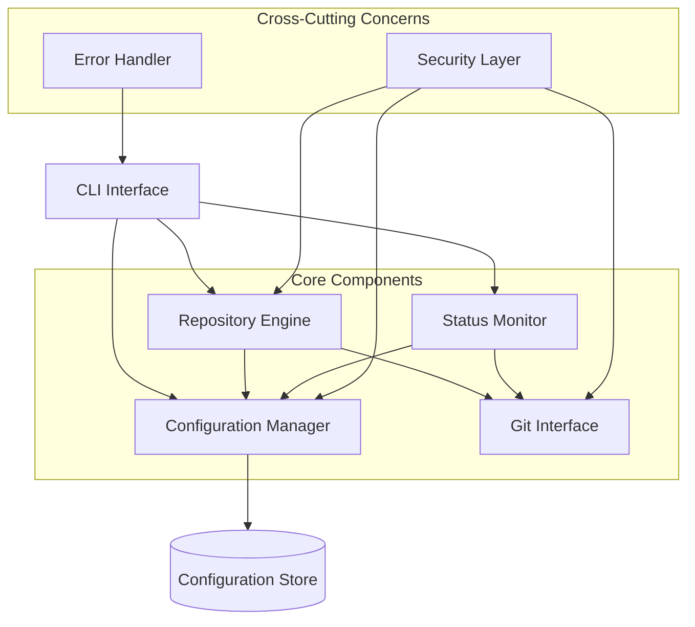
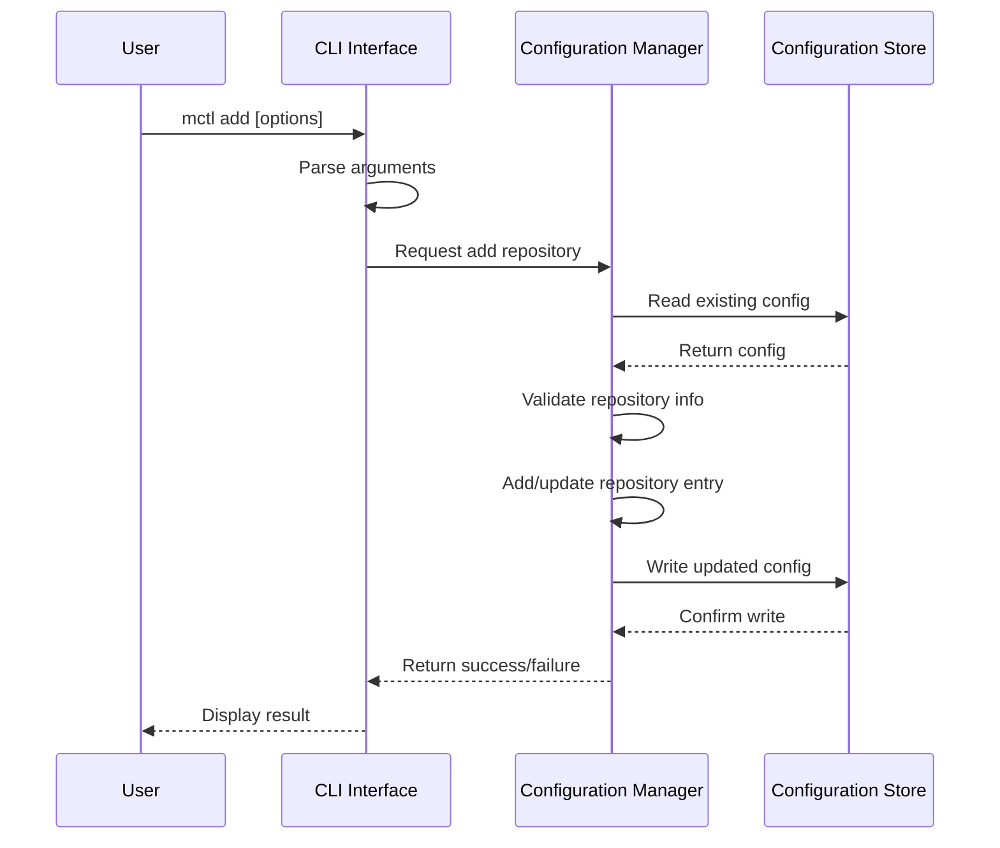
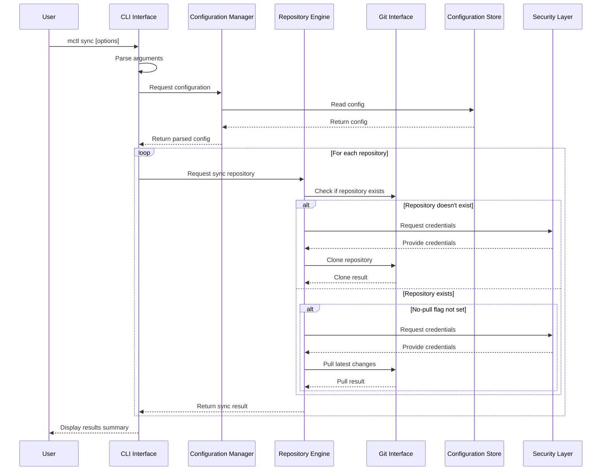
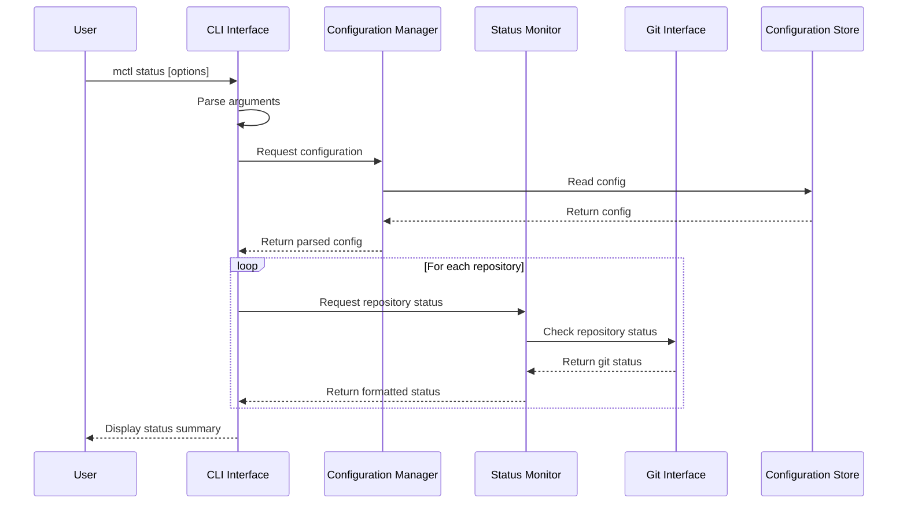
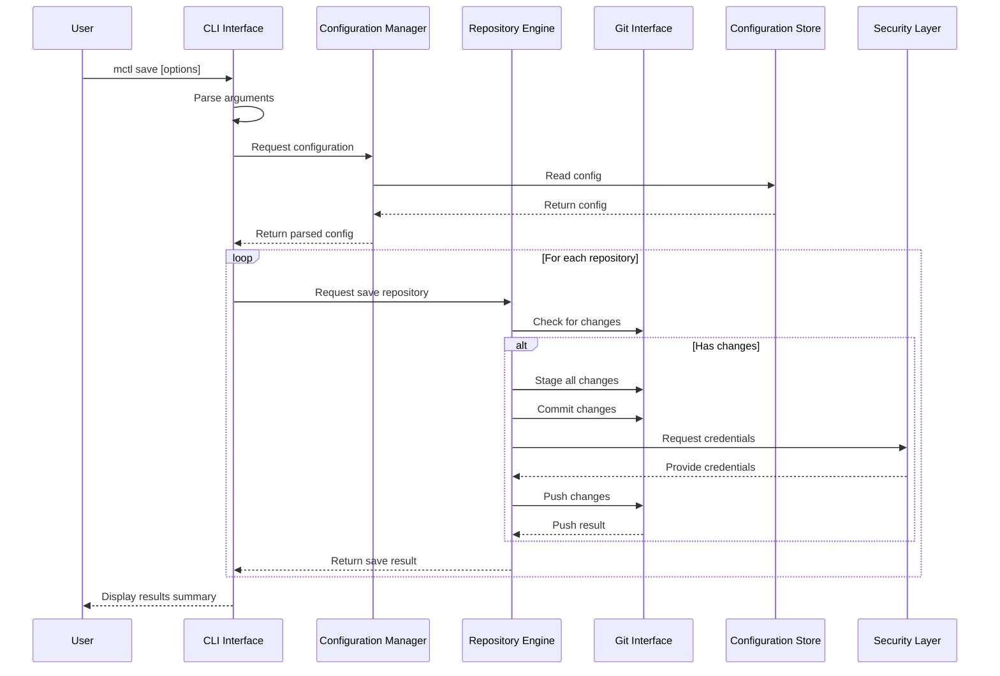
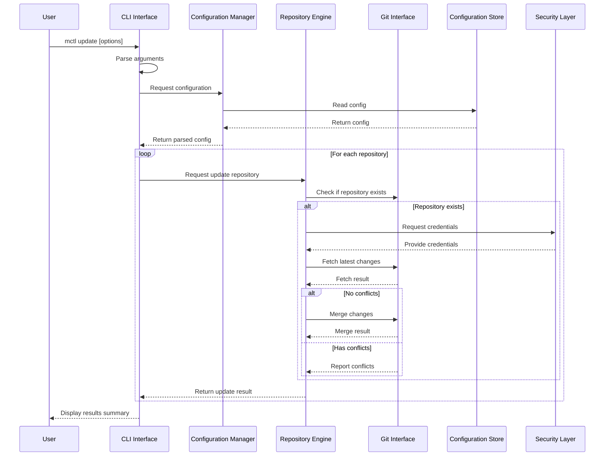

# MCTL Architecture Design

## Overview

MCTL (Mirror Control) is a command-line interface (CLI) tool for efficient git repository synchronization and mirroring. This document outlines the architecture for implementing MCTL in Rust, focusing on modularity, security, and extensibility.

## Table of Contents

1. [Component Architecture](#component-architecture)
2. [Data Flow Diagrams](#data-flow-diagrams)
3. [Configuration Structure](#configuration-structure)
4. [Module Boundaries and Interfaces](#module-boundaries-and-interfaces)
5. [Error Handling Strategy](#error-handling-strategy)
6. [Security Considerations](#security-considerations)
7. [Testing Strategy](#testing-strategy)

## Component Architecture

The MCTL system is designed with the following core components:



### Component Descriptions

1. **CLI Interface**: Handles command-line parsing, user interaction, and orchestrates the execution of commands.
2. **Configuration Manager**: Manages reading, validating, and writing configuration files.
3. **Repository Engine**: Core component responsible for repository operations (cloning, updating, etc.).
4. **Status Monitor**: Monitors repository status and provides reporting capabilities.
5. **Git Interface**: Abstracts git operations and provides a consistent interface for git commands.
6. **Security Layer**: Manages credentials, authentication, and secure operations.
7. **Error Handler**: Centralized error handling and reporting.
8. **Configuration Store**: Storage for configuration data (TOML files).

## Data Flow Diagrams

### `mctl add` Command Flow



### `mctl sync` Command Flow



### `mctl status` Command Flow



### `mctl save` Command Flow



### `mctl update` Command Flow



## Configuration Structure

The configuration is stored in TOML format with the following structure:

```rust
// Configuration data structures

pub struct Config {
    pub repositories: Vec<Repository>,
    pub base_path: Option<String>,
    pub default_branch: Option<String>,
}

pub struct Repository {
    pub git_url: String,
    pub path: String,
    pub branch: Option<String>,
    pub name: Option<String>,
}
```

Example TOML configuration:

```toml
# Optional global settings
base_path = "./repos"
default_branch = "main"

# Repository definitions
[[repositories]]
git_url = "git@github.com:example/repo.git"
path = "example-repo"
branch = "main"

[[repositories]]
git_url = "https://github.com/example/docs.git"
path = "docs"
branch = "develop"
```

## Module Boundaries and Interfaces

### CLI Module

```rust
// Public interfaces for CLI module

pub struct Cli {
    // CLI state
}

impl Cli {
    pub fn new() -> Self;
    pub fn parse_args() -> Result<Command, CliError>;
    pub fn execute(command: Command) -> Result<(), CliError>;
}

pub enum Command {
    Add {
        git_url: String,
        path: String,
        branch: Option<String>,
    },
    Sync {
        config_path: Option<String>,
        dest: Option<String>,
        no_pull: bool,
        force: bool,
        parallel: Option<usize>,
    },
    Status {
        config_path: Option<String>,
        verbose: bool,
    },
    Save {
        message: Option<String>,
    },
    Update {
        config_path: Option<String>,
        verbose: bool,
        force: bool,
        dry_run: bool,
        repo: Option<String>,
    },
}
```

### Configuration Manager Module

```rust
// Public interfaces for Configuration Manager module

pub struct ConfigManager {
    // Configuration manager state
}

impl ConfigManager {
    pub fn new() -> Self;
    pub fn load_config(path: &str) -> Result<Config, ConfigError>;
    pub fn save_config(config: &Config, path: &str) -> Result<(), ConfigError>;
    pub fn add_repository(config: &mut Config, repo: Repository) -> Result<(), ConfigError>;
    pub fn validate_config(config: &Config) -> Result<(), ConfigError>;
}
```

### Repository Engine Module

```rust
// Public interfaces for Repository Engine module

pub struct RepositoryEngine {
    // Repository engine state
}

impl RepositoryEngine {
    pub fn new(git_interface: GitInterface, security_layer: SecurityLayer) -> Self;
    pub fn sync_repository(repo: &Repository, options: SyncOptions) -> Result<SyncResult, RepoError>;
    pub fn save_repository(repo: &Repository, message: Option<String>) -> Result<SaveResult, RepoError>;
    pub fn update_repository(repo: &Repository, options: UpdateOptions) -> Result<UpdateResult, RepoError>;
}

pub struct SyncOptions {
    pub no_pull: bool,
    pub force: bool,
    pub dest: Option<String>,
}

pub struct UpdateOptions {
    pub force: bool,
    pub dry_run: bool,
}

pub struct SyncResult {
    pub cloned: bool,
    pub updated: bool,
    pub skipped: bool,
    pub error: Option<String>,
    pub changes: Option<ChangeStats>,
}

pub struct SaveResult {
    pub committed: bool,
    pub pushed: bool,
    pub error: Option<String>,
    pub commit_hash: Option<String>,
}

pub struct UpdateResult {
    pub updated: bool,
    pub conflicts: bool,
    pub error: Option<String>,
    pub changes: Option<ChangeStats>,
}

pub struct ChangeStats {
    pub files_changed: usize,
    pub insertions: usize,
    pub deletions: usize,
}
```

### Status Monitor Module

```rust
// Public interfaces for Status Monitor module

pub struct StatusMonitor {
    // Status monitor state
}

impl StatusMonitor {
    pub fn new(git_interface: GitInterface) -> Self;
    pub fn check_status(repo: &Repository) -> Result<RepoStatus, StatusError>;
    pub fn format_status(status: &RepoStatus, verbose: bool) -> String;
}

pub struct RepoStatus {
    pub exists: bool,
    pub branch: Option<String>,
    pub branch_status: Option<BranchStatus>,
    pub modified_files: Vec<FileStatus>,
    pub untracked_files: Vec<String>,
    pub is_clean: bool,
}

pub struct BranchStatus {
    pub ahead: usize,
    pub behind: usize,
}

pub struct FileStatus {
    pub path: String,
    pub status_code: String,
}
```

### Git Interface Module

```rust
// Public interfaces for Git Interface module

pub struct GitInterface {
    // Git interface state
}

impl GitInterface {
    pub fn new() -> Self;
    pub fn clone_repository(url: &str, path: &str, branch: Option<&str>) -> Result<(), GitError>;
    pub fn pull_repository(path: &str, force: bool) -> Result<PullResult, GitError>;
    pub fn check_status(path: &str) -> Result<GitStatus, GitError>;
    pub fn stage_all(path: &str) -> Result<(), GitError>;
    pub fn commit(path: &str, message: &str) -> Result<String, GitError>;
    pub fn push(path: &str) -> Result<(), GitError>;
    pub fn fetch(path: &str) -> Result<(), GitError>;
    pub fn merge(path: &str, branch: &str, force: bool) -> Result<MergeResult, GitError>;
}

pub struct GitStatus {
    pub branch: String,
    pub is_clean: bool,
    pub ahead: usize,
    pub behind: usize,
    pub modified_files: Vec<GitFileStatus>,
    pub untracked_files: Vec<String>,
}

pub struct GitFileStatus {
    pub path: String,
    pub status_code: String,
}

pub struct PullResult {
    pub success: bool,
    pub fast_forward: bool,
    pub files_changed: usize,
    pub insertions: usize,
    pub deletions: usize,
}

pub struct MergeResult {
    pub success: bool,
    pub fast_forward: bool,
    pub conflicts: bool,
    pub files_changed: usize,
    pub insertions: usize,
    pub deletions: usize,
}
```

### Security Layer Module

```rust
// Public interfaces for Security Layer module

pub struct SecurityLayer {
    // Security layer state
}

impl SecurityLayer {
    pub fn new() -> Self;
    pub fn get_credentials(url: &str) -> Result<Credentials, SecurityError>;
    pub fn store_credentials(url: &str, credentials: &Credentials) -> Result<(), SecurityError>;
    pub fn clear_credentials(url: &str) -> Result<(), SecurityError>;
}

pub enum Credentials {
    SshKey {
        path: String,
        passphrase: Option<String>,
    },
    UserPass {
        username: String,
        password: String,
    },
    Token {
        token: String,
    },
    None,
}
```

### Error Handler Module

```rust
// Public interfaces for Error Handler module

pub struct ErrorHandler {
    // Error handler state
}

impl ErrorHandler {
    pub fn new() -> Self;
    pub fn handle_error(error: &MctlError) -> String;
    pub fn log_error(error: &MctlError);
}

pub enum MctlError {
    CliError(CliError),
    ConfigError(ConfigError),
    RepoError(RepoError),
    GitError(GitError),
    StatusError(StatusError),
    SecurityError(SecurityError),
}
```

## Error Handling Strategy

MCTL implements a comprehensive error handling strategy with the following principles:

1. **Error Types Hierarchy**: Domain-specific error types that implement a common error trait
2. **Contextual Errors**: Errors include context about where they occurred
3. **User-Friendly Messages**: Errors are translated into user-friendly messages
4. **Recovery Paths**: Where possible, errors include recovery suggestions
5. **Logging**: Detailed error information is logged for debugging

```rust
// Error handling architecture

pub trait MctlErrorTrait: std::error::Error {
    fn error_code(&self) -> ErrorCode;
    fn user_message(&self) -> String;
    fn recovery_hint(&self) -> Option<String>;
}

pub enum ErrorCode {
    // CLI errors
    InvalidArgument,
    MissingRequiredOption,
    
    // Config errors
    ConfigNotFound,
    InvalidConfigFormat,
    ConfigWriteFailed,
    
    // Repository errors
    RepositoryNotFound,
    RepositoryAccessDenied,
    
    // Git errors
    GitCommandFailed,
    GitAuthenticationFailed,
    GitMergeConflict,
    
    // Security errors
    CredentialsNotFound,
    InvalidCredentials,
    CredentialStoreFailed,
}

// Example implementation for ConfigError
pub struct ConfigError {
    pub code: ErrorCode,
    pub message: String,
    pub source: Option<Box<dyn std::error::Error>>,
    pub context: String,
}

impl MctlErrorTrait for ConfigError {
    fn error_code(&self) -> ErrorCode {
        self.code.clone()
    }
    
    fn user_message(&self) -> String {
        match self.code {
            ErrorCode::ConfigNotFound => format!("Configuration file not found: {}", self.context),
            ErrorCode::InvalidConfigFormat => format!("Invalid configuration format: {}", self.message),
            ErrorCode::ConfigWriteFailed => format!("Failed to write configuration: {}", self.message),
            _ => self.message.clone(),
        }
    }
    
    fn recovery_hint(&self) -> Option<String> {
        match self.code {
            ErrorCode::ConfigNotFound => Some(format!("Create a new configuration file with 'mctl add' or specify a different path with '--config'")),
            ErrorCode::InvalidConfigFormat => Some(format!("Check the syntax of your TOML file")),
            _ => None,
        }
    }
}
```

## Security Considerations

### Credential Management

1. **Environment Variables**: Support for credentials via environment variables
   ```
   GIT_USERNAME=username
   GIT_PASSWORD=token
   ```

2. **SSH Keys**: Primary authentication method using SSH keys
   - Support for custom SSH key paths
   - Support for SSH key passphrases

3. **Credential Helpers**: Integration with git credential helpers
   - Use system credential storage when available
   - Fall back to prompting when necessary

4. **No Hardcoded Credentials**: 
   - Never store credentials in configuration files
   - Warn users if they attempt to use URLs with embedded credentials

### Input Validation

1. **URL Validation**: Validate git URLs for proper format and security
2. **Path Validation**: Ensure paths are valid and don't contain directory traversal attacks
3. **Command Injection Prevention**: Sanitize all inputs used in git commands

### Secure Defaults

1. **SSH by Default**: Prefer SSH URLs over HTTPS when adding new repositories
2. **Minimal Permissions**: Request minimal permissions for access tokens
3. **Safe Operations**: Prevent destructive operations without explicit confirmation

## Testing Strategy

MCTL is designed for Test-Driven Development with the following testing approach:

### Unit Testing

1. **Module Tests**: Each module has comprehensive unit tests
2. **Mock Dependencies**: Dependencies are mocked for isolated testing
3. **Error Cases**: Test both success and error paths

```rust
// Example unit test for ConfigManager

#[cfg(test)]
mod tests {
    use super::*;
    
    #[test]
    fn test_load_valid_config() {
        let temp_dir = tempfile::tempdir().unwrap();
        let config_path = temp_dir.path().join("test_config.toml");
        
        std::fs::write(&config_path, r#"
            [[repositories]]
            git_url = "git@github.com:example/repo.git"
            path = "example-repo"
        "#).unwrap();
        
        let config_manager = ConfigManager::new();
        let result = config_manager.load_config(config_path.to_str().unwrap());
        
        assert!(result.is_ok());
        let config = result.unwrap();
        assert_eq!(config.repositories.len(), 1);
        assert_eq!(config.repositories[0].git_url, "git@github.com:example/repo.git");
        assert_eq!(config.repositories[0].path, "example-repo");
    }
    
    #[test]
    fn test_load_invalid_config() {
        let temp_dir = tempfile::tempdir().unwrap();
        let config_path = temp_dir.path().join("invalid_config.toml");
        
        std::fs::write(&config_path, r#"
            [repositories]
            git_url = "git@github.com:example/repo.git"
            path = "example-repo"
        "#).unwrap();
        
        let config_manager = ConfigManager::new();
        let result = config_manager.load_config(config_path.to_str().unwrap());
        
        assert!(result.is_err());
        let error = result.unwrap_err();
        assert_eq!(error.error_code(), ErrorCode::InvalidConfigFormat);
    }
}
```

### Integration Testing

1. **Command Tests**: Test each CLI command end-to-end
2. **Git Repository Fixtures**: Use temporary git repositories for testing
3. **Network Mocking**: Mock git remote operations for reliable testing

```rust
// Example integration test for sync command

#[cfg(test)]
mod integration_tests {
    use super::*;
    
    #[test]
    fn test_sync_command() {
        // Set up test repositories
        let (remote_repo, local_config) = setup_test_environment();
        
        // Run sync command
        let result = execute_command(&["sync", "--config", local_config.to_str().unwrap()]);
        
        // Verify results
        assert!(result.is_ok());
        assert!(std::path::Path::new("./repos/example-repo").exists());
        assert!(std::path::Path::new("./repos/example-repo/.git").exists());
    }
    
    fn setup_test_environment() -> (TempDir, PathBuf) {
        // Create a remote repository
        let remote_repo = TempDir::new().unwrap();
        init_git_repo(&remote_repo);
        
        // Create a local config file
        let config_dir = TempDir::new().unwrap();
        let config_path = config_dir.path().join("mirror.toml");
        
        std::fs::write(&config_path, format!(r#"
            [[repositories]]
            git_url = "{}"
            path = "example-repo"
        "#, remote_repo.path().to_str().unwrap())).unwrap();
        
        (remote_repo, config_path)
    }
}
```

### Property-Based Testing

1. **Config Generation**: Generate random valid and invalid configurations
2. **Command Combinations**: Test various combinations of command options
3. **Error Handling Properties**: Verify error handling behavior across inputs

```rust
// Example property-based test

#[cfg(test)]
mod property_tests {
    use super::*;
    use proptest::prelude::*;
    
    proptest! {
        #[test]
        fn test_add_repository_properties(
            git_url in r"[a-zA-Z0-9@:/_.-]+",
            path in r"[a-zA-Z0-9/_.-]+",
            branch in option::of(r"[a-zA-Z0-9/_.-]+"),
        ) {
            let mut config = Config { repositories: vec![], base_path: None, default_branch: None };
            let repo = Repository {
                git_url: git_url.clone(),
                path: path.clone(),
                branch: branch.clone(),
                name: None,
            };
            
            let config_manager = ConfigManager::new();
            let result = config_manager.add_repository(&mut config, repo);
            
            // If URL and path are valid, add should succeed
            if is_valid_git_url(&git_url) && is_valid_path(&path) {
                prop_assert!(result.is_ok());
                prop_assert_eq!(config.repositories.len(), 1);
                prop_assert_eq!(config.repositories[0].git_url, git_url);
                prop_assert_eq!(config.repositories[0].path, path);
                prop_assert_eq!(config.repositories[0].branch, branch);
            } else {
                prop_assert!(result.is_err());
            }
        }
    }
}